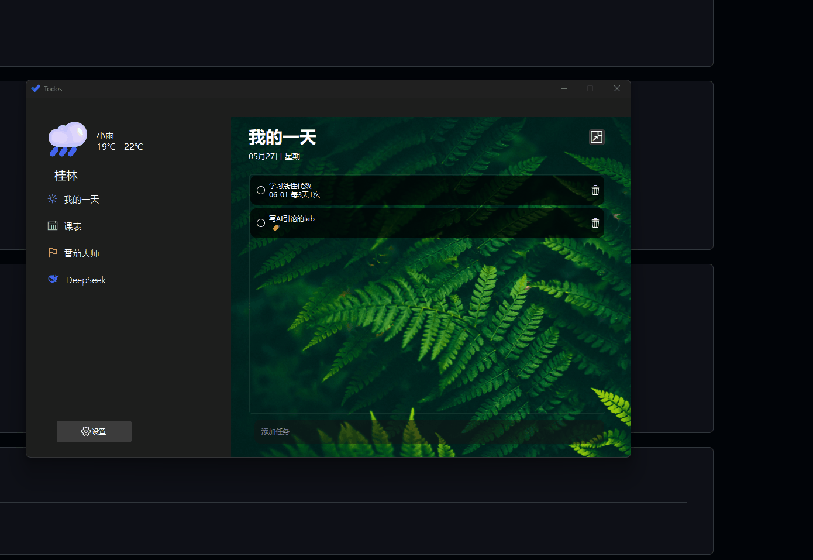
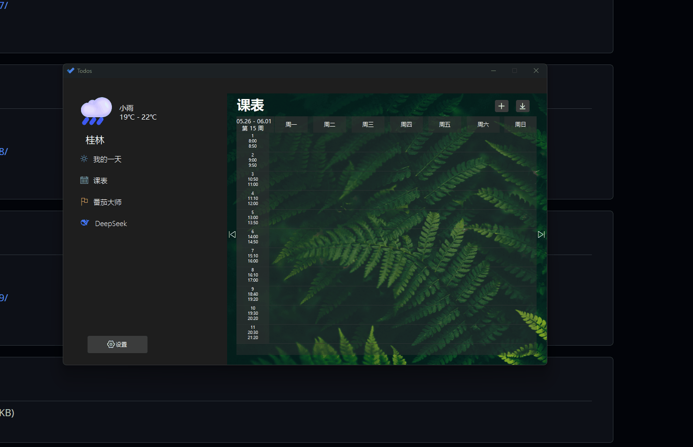
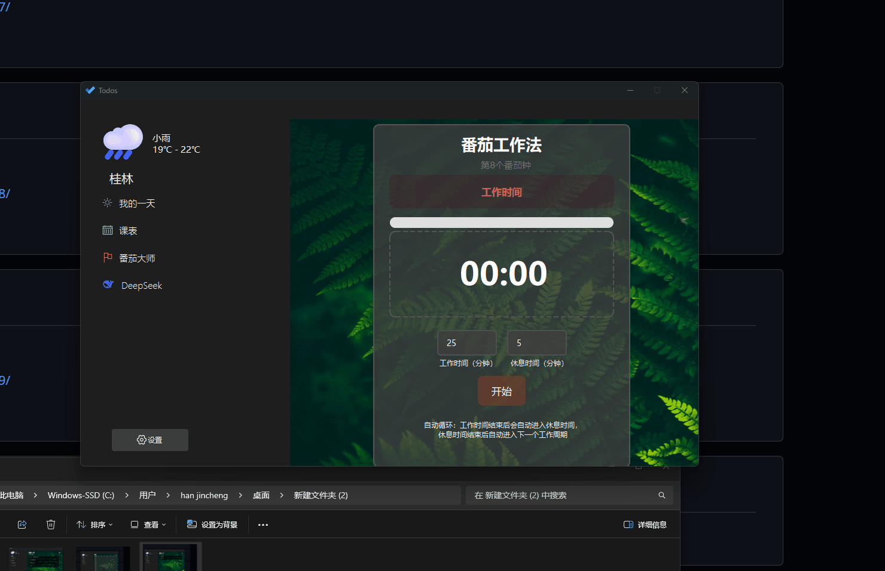
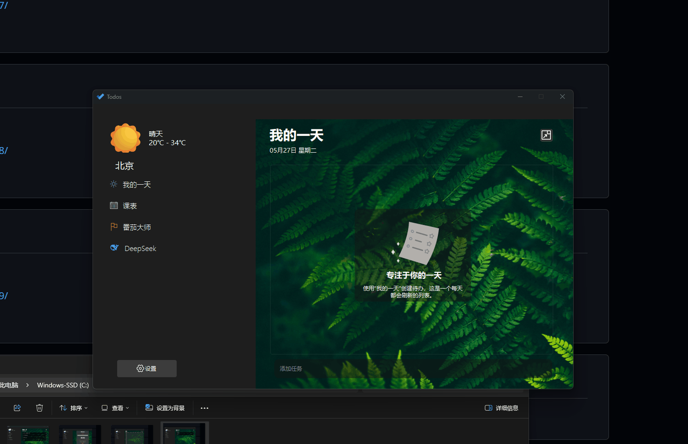
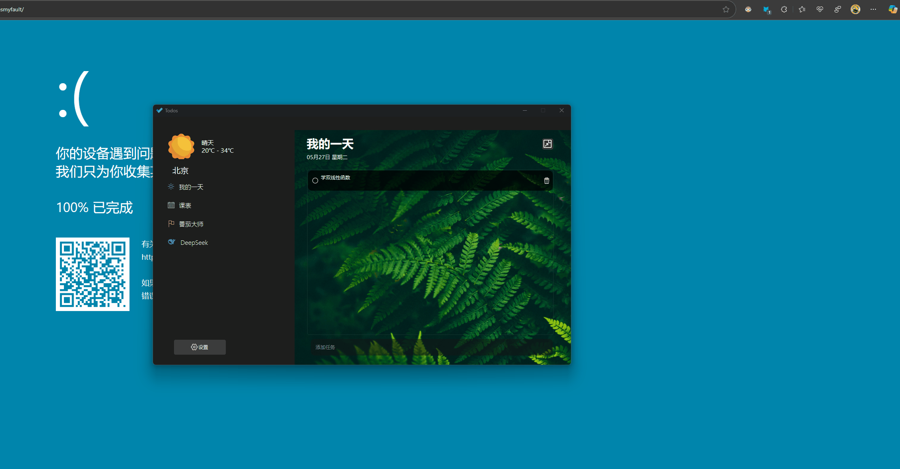

# Todos_PKU_chengshe
基于北京大学程序设计实习课程大作业的要求，我们独立设计并开发了一款适用于北京大学学生的日程管理软件——Todos of PKU。

## 功能介绍
该软件当前有四大主要功能：
1. **我的一天**：你可以在这个模块里添加待办，并设置结束日期/结束时间、设置循环类型。当待办被创建成功后，你可以通过点击待办左边区域标记已完成，点击待办中间区域编辑待办（支持对时间/日期的重修改、对待办标题的重修改，添加详情等等），点击待办右侧区域删除待办。

  
2. **课表**：你可以在这个模块里添加课程，课程根据时间日期采用了类似于wakeup的排版，支持手动导入课程并设置课程颜色、课程周数、课程时间、课程详情（可选），另外，我们还支持从网页便携导入课表，支持课程的增删改查，并且支持查看不同周数的课表，即每节课是根据课程信息和当前查看的周数动态显示的。

3. **番茄大师**：这是一个番茄钟的功能设计，你可以自由设置番茄时间和休息时间，我们会动态显示当前的进度条，并且提供暂停、重新开始选项，同时我们也提供了与大窗口完全同步的右下角小窗口，以期在工作时显示番茄钟提高效率。另外，我们会统计当前番茄钟是你的第几个番茄钟，增强专注的正反馈。

4. **DeepSeek**：这是一个非常创新性的设计，我们在我们的项目里内置了deepseek-v3的api来保障这个模块的正常运行。这个模块分为两个部分：第一个部分**获取你的每日工作建议**可以根据你已经创建的待办和当日课表智能为你生成当日的时间安排，第二个部分**与DeepSeek深入交流**则是提供了一个在该应用里与ai聊天的功能，这一模块为你提供了便携的窗口。

除了这四个主要功能之外，我们还提供了很多实用的小功能，比如：你可以在**我的一天**这里选择将主窗口缩小到右上角，只保留当日待办用来在实际工作中便携使用；主页面的左上角还可以显示所在地的天气；在设置页面，你还可以更改背景图片，更改学期开始周，更改所在地来让天气正确显示，清理本地缓存以删除所有的待办和课表信息。

## 具体实现
该项目包含了大量的子窗口类和抽象类：
**窗口类：**

1. widget类，这个类是项目的核心，软件的主窗口就是这个widget，其中实现了各种Qt控件与交互逻辑代码的链接，包含但不限于：“我的一天”中把待办从vector中绘制到窗口上、“我的一天”中实现待办的编辑修改、“课表”对不同课程的动态显示、“课表”显示不同周的课程表、“番茄钟”模块的时间记录及修改，“番茄钟”各个按钮的槽链接、“deepseek”模块的展示、“设置”模块的各项功能显示及控件对应等等。其包含的类函数及成员在`widget.h`文件里，可以自行查看。
2. smallwidget类，这个类是将“我的一天”置于右上角后显示的窗口类，包含了widget类中的“我的一天”中的所有实现，可以将其称之为widget类的真子类。
3. datecalender类，这个类是“我的一天”中选择日期时间时打开的窗口类，包含了日历绘制及选择，输入截止时间（可选）并保存发送信号的功能。
4.  subrepeat类，这个类也是在“我的一天”中选择循环方式后打开的窗口类，包含选择x日/周/月循环并保存发送信号的功能，这个类的实现相较于其他类较简单。
5.  editclasswidget类，这个类是“课表”中的手动添加课程或者单击课程按钮后打开的“窗口编辑”窗口类，包含课程名称修改、课程按钮颜色修改、课程详情修改、课程周数（某几周上课）修改，课程时间修改功能，同样支持保存后关闭并发送信号更新信息的功能。
6.  chooseweek_style_widget类，这个类是上一个类中提到的“课程周数（某几周上课）修改”后打开的窗口类，支持自主选择某几周上课还是不上课，同样也提供了“全周”“单周”“双周”快速选择，这个类也是支持保存后关闭并发送信号来更新信息的功能。
7.  choosetime_style_widget类，这个类是*5*中提到的“课程时间修改”后打开的窗口类，采用了先进的滚轮切换方式来选择周几、起始课数、结束课数，同样支持保存后并发送信号来更新信息。
8.  tomatoclock类，这个类是番茄钟小窗口的窗口类，用于打开番茄钟位于右下角的小窗口，并通过复杂的信号来实现与主窗口信息同步的通信，通过先进的ui设计实现进度条的动态进行。

**抽象类**
9.  browserwindow类，这个类是用于“课表”模块从北大门户爬取课表数据的浏览
