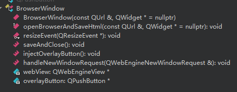

# Todos_PKU_chengshe
基于北京大学程序设计实习课程大作业的要求，我们独立设计并开发了一款适用于北京大学学生的日程管理软件——Todos of PKU。

## 亮点

-   **高精度用户交互与多窗口协同：**
    * **UI/UX精细化**：通过自定义控件与多级子窗口设计，实现复杂数据输入与编辑的流畅体验。
    * **主副窗口联动**：`tomatoclock` 类构建主应用与独立小窗口间双向通信，确保状态实时同步，提升用户专注效率。
    * **界面美学**：采用现代深色主题与QSS美化，配合自定义控件，提供一致且美观的人机交互界面。

-   **前沿AI模型集成与智能服务：**
    * **LLM应用**：内置 DeepSeek-v3 大模型 API (`deepseekclient` 类)，实现应用内AI能力。
    * **智能日程规划**：创新性地利用AI分析用户待办与课表数据，生成个性化时间管理建议。
    * **AI对话**：提供便捷的AI对话功能，拓展应用服务边界。

-   **健壮的Web通信与数据管理层：**
    * **Web数据抓取**：`browserwindow` 类整合Qt WebEngine，实现门户网站课表自动化抓取。
    * **外部API集成**：`weatherfetcher` 类实现第三方天气API可靠调用，增强信息服务能力。
    * **本地数据持久化**：采用JSON格式 (`savedata`, `filehandler` 类) 进行结构化存储，保障数据完整性。

-   **卓越的工程鲁棒性与防呆设计：**
    * **防御性编程**：内嵌多层防呆机制，涵盖逻辑校验（如学期起始日期）、边界控制（课表周数导航）、并发编辑规避等。
    * **异步/阻塞处理**：关键耗时操作（Web抓取）采用异步模式，确保UI响应。外部API请求（DeepSeek、天气）实现**请求级阻塞**而非全局阻塞，防止重复请求同时保持UI可用性。
 
## 编译环境
Qt 6.8.3(MSVC 2022, x86_64) with network, webenginewidgets and core gui network.

Windows 11 and Mac were tested; Linux was not.

## 功能介绍
该软件当前有四大主要功能：
1. **我的一天**：用户可以在这个模块里添加待办，并设置结束日期/结束时间、设置循环类型。当待办被创建成功后，用户可以通过点击待办左边区域标记已完成，点击待办中间区域编辑待办（支持对时间/日期的重修改、对待办标题的重修改，添加详情等等），点击待办右侧区域删除待办。

  
2. **课表**：用户可以在这个模块里添加课程，课程根据时间日期采用了类似于wakeup的排版，支持手动导入课程并设置课程颜色、课程周数、课程时间、课程详情（可选），另外，我们还支持从网页便携导入课表，支持课程的增删改查，并且支持查看不同周数的课表，即每节课是根据课程信息和当前查看的周数动态显示的。

3. **番茄大师**：这是一个番茄钟的功能设计，用户可以自由设置番茄时间和休息时间，我们会动态显示当前的进度条，并且提供暂停、重新开始选项，同时我们也提供了与大窗口完全同步的右下角小窗口，以期在工作时显示番茄钟提高效率。另外，我们会统计当前番茄钟是用户的第几个番茄钟，增强专注的正反馈。

4. **DeepSeek**：这是一个非常创新性的设计，我们在我们的项目里内置了deepseek-v3的api来保障这个模块的正常运行。这个模块分为两个部分：第一个部分**获取用户的每日工作建议**可以根据用户已经创建的待办和当日课表智能为用户生成当日的时间安排，第二个部分**与DeepSeek深入交流**则是提供了一个在该应用里与ai聊天的功能，这一模块为用户提供了便携的窗口。

除了这四个主要功能之外，我们还提供了很多实用的小功能，比如：用户可以在**我的一天**这里选择将主窗口缩小到右上角，只保留当日待办用来在实际工作中便携使用；主页面的左上角还可以显示所在地的天气；在设置页面，用户还可以更改背景图片，更改学期开始周，更改所在地来让天气正确显示，清理本地缓存以删除所有的待办和课表信息。

## 具体实现
该项目包含了大量的子窗口类和非窗口类：
**子窗口类：**

1. widget类，这个类是项目的核心，软件的主窗口就是这个widget，其中实现了各种Qt控件与交互逻辑代码的链接，包含但不限于：“我的一天”中把待办从vector中绘制到窗口上、“我的一天”中实现待办的编辑修改、“课表”对不同课程的动态显示、“课表”显示不同周的课程表、“番茄钟”模块的时间记录及修改，“番茄钟”各个按钮的槽链接、“deepseek”模块的展示、“设置”模块的各项功能显示及控件对应等等。其包含的类函数及成员在`widget.h`文件里，可以自行查看。

  
  

2. smallwidget类，这个类是将“我的一天”置于右上角后显示的窗口类，包含了widget类中的“我的一天”中的所有实现，可以将其称之为widget类的真子类。

3. datecalender类，这个类是“我的一天”中选择日期时间时打开的窗口类，包含了日历绘制及选择，输入截止时间（可选）并保存发送信号的功能。

  
  

4.  subrepeat类，这个类也是在“我的一天”中选择循环方式后打开的窗口类，包含选择x日/周/月循环并保存发送信号的功能，这个类的实现相较于其他类较简单。

5.  edit_class_widget类，这个类是“课表”中的手动添加课程或者单击课程按钮后打开的“窗口编辑”窗口类，包含课程名称修改、课程按钮颜色修改、课程详情修改、课程周数（某几周上课）修改，课程时间修改功能，同样支持保存后关闭并发送信号更新信息的功能。

  
  

7.  chooseweek_style_widget类，这个类是上一个类中提到的“课程周数（某几周上课）修改”后打开的窗口类，支持自主选择某几周上课还是不上课，同样也提供了“全周”“单周”“双周”快速选择，这个类也是支持保存后关闭并发送信号来更新信息的功能。

8.  choosetime_style_widget类，这个类是*5*中提到的“课程时间修改”后打开的窗口类，采用了先进的滚轮切换方式来选择周几、起始课数、结束课数，同样支持保存后并发送信号来更新信息。

  

9.  tomatoclock类，这个类是番茄钟小窗口的窗口类，用于打开番茄钟位于右下角的小窗口，并通过复杂的信号槽机制实现主副窗口间状态同步与数据一致性，通过先进的ui设计实现进度条的动态进行。

**非窗口类**

  
  

1.  browserwindow类，这个类是用于“课表”模块从北大门户爬取课表数据的浏览器窗口，支持登录门户IAAA页面并点开“我的课程表”然后点击“save”将数据爬取到本地并向widget返回一个包含了课程元素的vector，利用了Qt中的webengine组件实现了模拟用户登录与html解析以精确抓取课表数据。。

2. custombutton类，这个类是基于QPushbutton类的对widget中的待办自主设计按钮的自主控件类，集成了“完成”“编辑”“删除”三个按钮功能区，并为按钮设计了美观大气的样式。

  
  

3. smallcustombutton类，这个类与上一个类类似，是在smallwidget中显示待办的翻版，具体内容不再重复。

4. edit_class_button类，这个类同样是基于QPushbutton类，但是他是对“课表”中课程按钮的自主设计的控件类，可以显示不同颜色、按钮文本、根据课程时间选择显示位置及大小，并将按钮点击的槽函数设置成打开editclasswidget窗口以编辑课程。

  
  

5. deepseekclient类，这个类是用于向deepseek发送请求并得到结果的类，有“单一对话”“上下文连续对话”两个函数重载，实现了"DeepSeek"这一功能。

6. weatherfetcher类，这个类是用于向`https://wttr.in/`发送请求并得到某地天气结果的类，可以根据输入所在地区得到目标地区天气的简略信息，是“显示天气”这一小功能的基础。

  

7. savedata类，这个类用于将课程信息写入json文件，并可以从已有的json文件里读取，是课程信息文件保存和读取的基础。

8. linearprogress类，这个类是一个简单的进度条widget，仅仅用于在“番茄大师”模块中显示水平直线的进度条。

9. filehandler类，这个类是对savedata类进行的外层的封装，使其更易用，更具有逻辑。

## 工作量分析
本项目的有效代码量为：

| 文件类型 | 文件数量 | 代码行数 |
|----------|-----------|----------|
| `.cpp`   | 19        | 4728     |
| `.h`     | 20        | 798      |
| **总计** | **39**    | **5526** |

（不含ui文件设计）

（鉴于本项目ui文件之多及ui设计用心精美，Qt样式表（QSS）的设计复杂，我们认为这部分的工作量不容忽视）

本项目的框架与大部分主要功能与UI设计主要由韩金成同学完成，待办的文件读取及保存、番茄钟的创意及小窗口的实现以及展示视频的录制剪辑由汤谨丞同学完成，课程文件的json文件读写、由教务部网站导出课程列表的web浏览器操作及功能以及三人的代码整合由刘英哲同学完成。

## 反思

1. 我们前期并没有认识到git的重要性，因为不熟悉这个工具而没有去使用，实际上直到路演这段时间，韩同学把文件迁移到本仓库之后我们才认识到git对于团队开发多分支支持的先进性，之前的“网盘——专人整合”模式太依赖专人的效率，幸运地是我们并没有遇到因专人不在而造成的拥塞问题，但是感觉在开发过程中没有用到git的分布式版本控制与协作管理仍然是很大的遗憾。但是！尽管如此，我们通过高效率的专人整合模式，保证了项目进度并最终高质量完成，这也锻炼了项目管理和协作中的应变能力。
2. 我们的选题——“日程管理”并不成功，这个选题虽然说技术含量较低且较成熟容易做，但是它的上限也比较低，难以添加更多更有深度的功能以增加技术含量。然而，我们也意识到，本次大作业考察的重点是对Qt和面向对象编程的应用，而非技术深度本身。从这个角度看，我们的选题是成功的，它使得我们能够深入实践Qt的UI/UX设计，并大胆探索AI应用集成，而非陷入过于底层的复杂技术细节，确保了项目在有限时间内的完成度与创新性。
3. 我们的“我的一天”模块为了简洁，为了把简洁留给用户、把复杂留给自己的目的，隐藏了相当大的工作量。我个人认为，作为一款实用的软件而言，我们的这种复杂与简洁的平衡做的刚刚好，但是作为一个大作业而言，这有可能导致我们的隐藏工作量被忽视，**为了解决大作业评审时可能存在的理解偏差，我们特此在报告的‘具体实现’部分，详尽阐述了这些看似简单实则复杂的交互组件和其背后的技术实现**。
4. 我们的DeepSeek模块因为多方面的原因（经费、精力and目标），尚不能提供非常快速且专用的大语言模型，而且对当日的规划也只是做出了文字呈现，并没有与其他模块进行更深度的融合以提升使用体验，在客观而严苛地评价下，它的易用性完全未被挖掘，但是还是由于它是大作业的原因，我们只能提出这样的一个概念，没有足够的资源去优化此模式，但我们认为它成功展示了LLM在个人效率工具中的应用前景，并为未来在资源允许条件下进行更深入的功能性迭代与技术优化奠定了基础。
